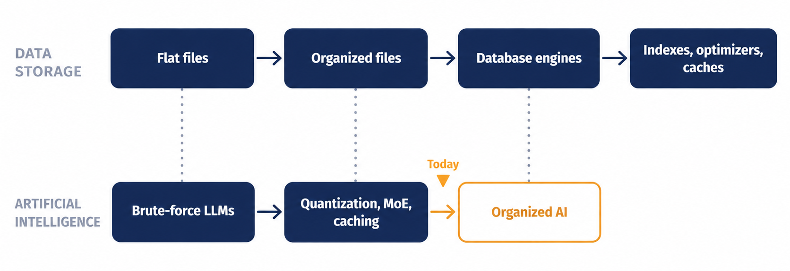

# Beyond Brute Force: AI's Database Moment

**Why the next major gains in AI will come from organization, not scale, and five architectural proposals worth testing now.**

*By Robbie B. Moore | October 2026*

## The idea in brief

Early PC programmers didn't have databases. They had flat files. Then came organized files, database engines, and indexes, and each step won by eliminating work rather than doing it faster.

AI is in its flat-file era. Today's large language models still run largely on brute force. The biggest recent efficiency wins (PagedAttention, FlashAttention, speculative decoding, DeepSeek's Engram) all came from borrowing classic computing ideas, but the field is borrowing them one at a time.

This white paper:

1. **Diagnoses six structural inefficiencies** in how AI is built today, each with a historical parallel.
2. **Proposes five architectural fixes**, led by a **semantic address space** (organize every word by meaning, and let routing, memory, and caching share it) and **locality by design** (route by discipline so sparse models can run in a fraction of the memory).
3. **Names the closest prior work** for each proposal, what is actually new, and **the cheapest experiment that could prove it wrong**.

**[Read the white paper](white-paper.md)**

## Help test it

The point of publishing this openly is to find out whether these ideas have merit. Evidence in either direction is valuable.

- **Found an error or counterevidence?** [Challenge a claim](../../issues/new?template=challenge-a-claim.yml)
- **Ran one of the experiments?** [Share your results](../../issues/new?template=share-experiment-results.yml)
- **Want to discuss?** Use [Discussions](../../discussions)

The three cheapest experiments are described at the end of the white paper. The first, measuring expert working sets in an open mixture-of-experts model, needs no training at all.

## Contents

| Path | What it is |
|---|---|
| [white-paper.md](white-paper.md) | The full white paper |
| [figures/](figures/) | Figures used in the paper |
| [companion/linkedin-carousel.pdf](companion/linkedin-carousel.pdf) | 10-slide summary |
| [CHANGELOG.md](CHANGELOG.md) | Corrections and revisions |
| [CITATION.cff](CITATION.cff) | Citation metadata |

## License and citation

The white paper, figures, and companion materials are licensed under [CC BY 4.0](LICENSE). You may share and adapt them for any purpose, including commercially, as long as you credit Robbie B. Moore.

Suggested citation:

> Moore, R. B. (2026). *Beyond Brute Force: AI's Database Moment.* https://github.com/cptrguru-hub/beyond-brute-force

GitHub's **"Cite this repository"** button (in the sidebar) provides this in APA and BibTeX formats.
