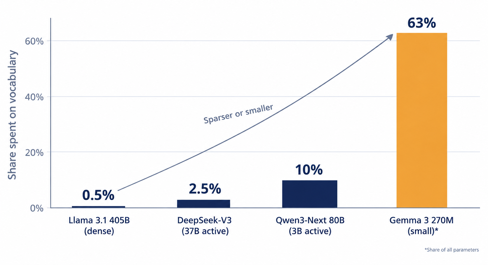

# Beyond Brute Force: AI's Database Moment

**Why the next major gains in AI will come from organization, not scale, and five architectural proposals worth testing now**

*By Robbie B. Moore | October 2026 | Version 1.0*

---

> **TL;DR**
> - AI is in its flat-file era: today's models still run largely on brute force, much like software before databases and indexes.
> - Six structural inefficiencies explain where the waste is, from memory traffic to a vocabulary organized by spelling instead of meaning.
> - Five proposals apply classic computing ideas on purpose. The two headline ideas are a **semantic address space** (organize every word by meaning, and let routing, memory, and caching share it) and **locality by design** (route by discipline so sparse models can run in a fraction of the memory).
> - Each proposal names its closest prior work and the cheapest experiment that could prove it wrong. Results either way are welcome.

---

Early PC programmers didn't have databases. They had files. Records were written sequentially, and finding one meant reading until you hit it. Then programmers learned to organize the data inside those files. Then came database engines. Then indexes, query optimizers, caches, and transactions. Each step delivered gains no amount of faster hardware could have matched, because each step eliminated work instead of doing it faster.

AI is in its flat-file era.

Today's large language models are extraordinary, but their core recipe is still largely brute force: tokenize text by spelling frequency, push every token through an enormous network, score every word in the vocabulary at every step, store facts and reasoning in the same weights, and scale everything up. It works. It is also the computing equivalent of scanning a file from the top every time you need a record.

This paper makes three arguments:

1. **The brute-force era is ending for economic reasons**, and the evidence is already in the numbers.
2. **The biggest recent efficiency wins came from importing classic systems ideas**, but the field is doing it piecemeal, one idea at a time.
3. **There are specific, testable architectural proposals** that apply those ideas systematically. I outline five, with the closest prior art for each and the cheapest experiment that would prove or disprove it.

*Figure 1. Every computing era moves from brute force to organization once scale makes waste expensive.*

---

## Why now: the economics have flipped

Brute force wins as long as it's cheaper than thinking about structure. That's no longer true.

- **Inference is now the main workload.** Deloitte's 2026 TMT Predictions forecast that inference will account for roughly two-thirds of all AI compute this year. Training costs are paid once. Inference waste is paid on every query, forever.
- **Reasoning is multiplying token counts.** Epoch AI finds reasoning models generate about 8x more tokens than non-reasoning models, and their response lengths are growing about 5x per year.
- **Energy follows tokens.** A 2026 study in *Joule* found that increasing output from 300 to 5,000 tokens raises per-query energy about 13x. If just 10% of a billion daily queries are long reasoning tasks, total daily energy more than doubles.
- **Agents re-read everything.** In one 42-call coding-agent session analyzed by NVIDIA, the agent read 11.7 tokens from cache for every token it wrote. Agents spend most of their effort re-reading context they've already seen.

When workloads grow faster than hardware improves, organization stops being an optimization and becomes a requirement. That's exactly when databases replaced flat files.

One objection deserves an answer up front: spending on scale is accelerating, not slowing. That's consistent with this argument, not a contradiction of it. Efficiency gains historically *increase* total demand (economists call this the Jevons paradox), and cheaper databases led to far more data, not less. Organization won't end the scaling race. It will decide who can afford to win it, and where AI can run: in data centers, but also on phones, in cars, and on specialized chips.

---

## The field is already borrowing, one idea at a time

Look at where the biggest AI efficiency gains of the last few years came from:

- **PagedAttention** (the core of vLLM) took operating-system virtual memory from the 1960s and applied it to the attention cache.
- **FlashAttention** reorganized attention around the memory hierarchy: the same math, restructured for locality, and dramatically faster.
- **Speculative decoding** is CPU speculative execution: guess ahead cheaply, verify, discard wrong guesses.
- **DeepSeek's Engram** (January 2026) added hash-table lookup memory so the model stops recomputing static facts and phrases. It beat an equal-compute baseline across benchmarks.
- **Hardwired inference chips** like Taalas's HC1 repeat the GPU-to-ASIC transition that happened in crypto mining: once a workload stabilizes, specialized silicon wins by orders of magnitude. (Taalas reports about 17,000 tokens per second on Llama 3.1 8B; that figure is company-reported.)
- **Ternary models** like PrismML's Bonsai restrict weights to -1, 0, and +1. Bonsai 2 27B fits in 5.9 GB and keeps about 98% of its base model's benchmark performance (company-reported).

None of these are new ideas in computing. They are new in AI. The question I want to pose is: **which classic organizational primitives haven't been imported yet, and what happens when they're applied together rather than one at a time?**

---

## Diagnosis: six structural inefficiencies

Before proposing fixes, it's worth being precise about where the waste is. I see six structural problems, each with a direct historical parallel.

### 1. Data movement dominates the cost

Moving data costs far more than computing on it. Mark Horowitz's widely cited ISSCC 2014 analysis put a DRAM access at roughly two orders of magnitude more energy than an arithmetic operation. LLM token generation is dominated by exactly this: a 2025 GPU characterization study measured decode at roughly 1-10 operations per byte loaded, with about three-quarters of GPU cycles spent stalled.

*Historical parallel: the memory hierarchy. Computing got fast by keeping the right data close, not by making arithmetic faster.*

### 2. Sparse models lack locality

Mixture-of-Experts models activate only a few percent of their parameters per token, which sounds like it should make them cheap to run on small devices. It doesn't, because their expert usage has little locality. Mixtral's authors found no clear expert specialization by topic, and consecutive tokens reuse the same expert at rates only modestly above chance (up to about 30%, vs. 12.5% for random assignment). A 2026 study went further: expert routing reflects the geometry of hidden states, not domain expertise, and during prompt processing, semantically different inputs activate nearly identical experts.

Without locality, you can't page efficiently. Offloading experts to slower memory works, but it's slow, so in practice every expert sits in fast memory, which is why a model that activates 37B parameters per token still needs a full multi-GPU server to hold its 671B weights.

*Historical parallel: Peter Denning's working-set model (1968). Virtual memory works only because programs reuse a small set of pages over time. Today's MoE models don't.*

### 3. Uniform compute regardless of difficulty

A standard transformer spends the same compute producing "the" as it does on the hardest step of a proof. Reasoning models compound this by spending thousands of tokens on problems that may not need them.

*Historical parallel: cost-based query optimizers (IBM System R, 1979), which choose a different execution plan for every query, and ARM's big.LITTLE cores, which route easy work to cheap cores.*

### 4. Recomputation instead of reuse

Roughly a third of search-engine queries are repeats. Agents re-read context constantly. Yet most inference still starts from scratch. The early evidence for reuse is strong: Agentic Plan Caching (2025) cut agent costs by about 50% by reusing plan templates, and Meta's System 2 Distillation cut generated tokens by 95-99% on several reasoning tasks.

*Historical parallel: memoization, CDNs, and just-in-time compilers.*

### 5. Knowledge is entangled with reasoning

Facts and reasoning live in the same weights, so updating one damages the other. In Meta's 2025 experiments, full finetuning on new facts dropped performance on a held-out knowledge benchmark by 89%, and LoRA by 71%. Updating only targeted memory slots dropped it by just 11%. Sequential model editing techniques degrade catastrophically as edits accumulate.

This becomes urgent with hardwired silicon. When the model is etched into a chip, entangled knowledge goes stale the day it ships.

*Historical parallel: the separation of data from application logic that created databases, and the ROM/RAM split in computer architecture.*

### 6. Representation is flat and organized by spelling, not meaning

Tokenizers are built from character frequency. The same text can take up to 15x more tokens in some languages than in others (Petrov et al., NeurIPS 2023). Every extra token is extra compute, latency, and cost.

The output layer, which scores every vocabulary entry at every step, is often dismissed as a rounding error. For large dense models it is: about 0.5% of per-token compute in Llama 3.1 405B. But the share **grows as models get sparser**, because the rest of the network shrinks while the vocabulary doesn't. From public model configs:

- Llama 3.1 405B (dense): about 0.5% of per-token weights
- DeepSeek-V3 (37B active): about 2.5%
- Qwen3-Next-80B-A3B (3B active): about 10%
- Gemma 3 270M (small model): about 63% of all parameters are embeddings

*Figure 2. The sparser or smaller the model, the more the flat vocabulary costs. The field is moving in exactly that direction.*

Meanwhile, research shows larger vocabularies make better models (a 500k vocabulary outperformed 5k by 9 points in Japanese), but in today's architecture the cost of the output layer grows linearly with vocabulary size.

*Historical parallel: library classification, B-tree indexes, and hierarchical network addressing. Nobody searches every book in a library to find one.*

---

## Five proposals

Each proposal below follows the same discipline: a historical analog, a mechanism, the closest prior art I could find, what is actually new, and the cheapest experiment that would test it. I've tried to be conservative about novelty claims. Where I say something is new, I mean I couldn't find it published, not that it can't exist somewhere.

### Proposal 1: A Semantic Address Space

**The idea:** Give every vocabulary item a learned, hierarchical address organized by meaning, for example *domain, concept region, concept, language, surface form*, and let every subsystem in the model share it.

Think of how the internet scales. Every packet carries a hierarchical address that every router understands. An interstate leads to a highway, then a thoroughfare, then a main street, then a side street. No router needs to know every address on Earth.

Today's LLMs have nothing equivalent. The vocabulary is a flat list. Expert routers, memory lookups, and caches each learn their own private, incompatible notion of similarity. A shared semantic address space would serve several purposes at once:

- **Lossless coarse-to-fine decoding.** Predict the address one level at a time, each level choosing among a few hundred options instead of 150,000+. The exact word is still the final destination, so no nuance is lost. "Superb" and "magnifique" remain distinct leaves; the model just doesn't search the whole map to find them.
- **Meaningful memory keys.** Engram keys its memory with hashing (mitigated by multiple hash heads and a gate), so entries that collide are unrelated by meaning. Keying memory by semantic address means collisions land among neighbors and degrade gracefully.
- **Shared cache keys** for reusing reasoning (Proposal 3).
- **Routing.** The upper levels of the address define disciplines for Proposal 2.
- **Cross-lingual sharing.** Everything above the language level is shared, so low-resource languages inherit structure from high-resource ones instead of paying a 15x token tax.
- **Interpretability.** The upper levels of an address are human-readable.

Polysemy is handled the way DNS handles a host with multiple records: "bank" can live under finance and under geography, and the probability of the word is the sum across its addresses.

**Closest prior art:** Hierarchical softmax (Morin and Bengio, 2005, built partly on WordNet; word2vec later used a frequency-based tree). Semantic IDs in generative retrieval and recommendation (Google's DSI and TIGER). Product-key memory, Engram, and TN-gram.

**What's new:** Using one learned hierarchical address space as the shared key across decoding, memory, caching, routing, and cross-lingual transfer inside a single model. Prior work uses semantic IDs for recommendation items or uses hierarchical output layers alone, not as a unifying primitive.

**Why it lost before and why that may change:** Hierarchical softmax was abandoned for two reasons. GPUs are so good at one big dense matrix multiply that walking a tree was slower in practice, and accuracy depended heavily on how well the tree was built, which hand-built or frequency-based trees often did poorly. A tree learned jointly with the model addresses the second problem directly. That verdict was reached on GPUs, for dense models, after subword tokenizers had shrunk vocabularies to 30-50k entries. Sparse models, growing vocabularies, and ternary and edge hardware all change the trade-off.

**Cheapest test:** Derive semantic IDs from a trained model's output embeddings using RQ-VAE, train a ~1B-parameter model with a hierarchical output layer, and compare perplexity, output-layer FLOPs, and accuracy on rare words and low-resource languages.

### Proposal 2: Locality by Design

**The idea:** Route once by discipline, then load only that discipline's working set.

Writing a novel, writing advertising copy, and solving a math problem are different disciplines. The first two are neighbors; the third is far away. A good system should know which one it's doing before it starts choosing words, the way you pick the right city before navigating its streets.

What counts as a discipline isn't hand-labeled. Following the principle of designing the shape and learning the contents, the *number* of top-level disciplines is fixed by design, and their boundaries and meanings are learned during training.

The mechanism has four parts:

- A **discipline router** reads the whole prompt and chooses a soft blend of disciplines (say, 80% marketing and 20% quantitative), aligned with the top levels of the semantic address space.
- A **locality objective** during training rewards stable expert usage within a session, so each session has a small expert working set.
- Experts outside the working set live in slow memory (flash, CPU RAM, or remote) and are prefetched when the blend shifts mid-response.
- In data centers, requests are **batched by discipline**, so experts held in fast memory serve many requests at once.

**Illustrative arithmetic:** An 80B-parameter MoE stored in ternary is about 15.8 GB. In Qwen3-Next-style architectures, about 96% of parameters are routed experts. If a session's working set were 25% of experts, the resident footprint would be about 4.4 GB. That's phone-class memory for an 80B-parameter model. To be clear, today's routers don't produce working sets like that. That's the point: locality has to be designed in, because current training objectives never reward it.

**Closest prior art:** DEMix layers (2021) and Branch-Train-MiX (2024) showed domain experts work. MoE-Infinity, SpecMD, Apple's LLM in a Flash, and domain-aware expert offloading all page experts out of fast memory.

**What's new:** Making locality a *training objective* tied to a semantic hierarchy, rather than trying to cache whatever locality happens to emerge. Existing offloading work optimizes around routers that were never designed for it.

**Cheapest test:** This one needs no training to start, and it doesn't depend on Proposal 1. Log expert usage across thousands of real sessions in an open MoE model and measure the working-set size per session. Then fine-tune the router with a locality loss and plot quality against working-set size.

### Proposal 3: Tiered Inference, a JIT Compiler for Reasoning

**The idea:** Apply the architecture of Java's HotSpot just-in-time compiler to reasoning.

HotSpot runs new code in a slow, general interpreter while profiling it. Hot paths get compiled into fast machine code, guarded by cheap checks. When a guard fails, execution **deoptimizes** back to the interpreter. That combination of profiling, promotion, guards, and graceful fallback is what made managed languages fast.

Applied to AI inference:

- **Tier 0:** Full reasoning, the interpreter.
- **Tier 1:** Cached plans and verified reasoning fragments, keyed by semantic address.
- **Tier 2:** Distilled specialist adapters for hot problem classes.
- **Tier 3:** Compiled tools or code for fully deterministic recurring tasks.
- **Guards:** Cheap verification on every fast-tier answer, such as unit tests, consistency checks, or verifier models.
- **Deoptimization:** Any guard failure falls back to Tier 0 and feeds the profiler.

**Why guards matter:** Meta's System 2 Distillation shows that some reasoning compiles beautifully (95-99% fewer tokens with equal or better accuracy) and some doesn't (distilled math accuracy collapsed from 53% to 7%). A JIT handles this by design. Code paths that don't compile well simply never get promoted, or get demoted when their guards fail.

**Closest prior art:** System 2 Distillation, Agentic Plan Caching, LLMs as Tool Makers, Voyager-style skill libraries, semantic caching (GPTCache, MeanCache), and some practitioner "agent JIT" projects.

**What's new:** The complete runtime with profiling, promotion thresholds, guards, and deoptimization working as one system. Individual tiers exist. The architecture that connects them does not, as far as I can find.

**Cheapest test:** Replay a large agent or coding workload through the tiers and measure the share of traffic served by each, the cost saved, and the guard-failure rate.

### Proposal 4: The ROM/RAM Split

**The idea:** Separate a frozen reasoning core from a versioned, transactional knowledge store, and design each for a different hardware lifecycle.

- **The reasoning core** is frozen, ternary, and potentially etched into silicon. It changes on a hardware cycle measured in years.
- **The knowledge store** uses memory layers (Engram-style or product-key) in updatable memory, with database semantics: versioned commits, provenance for every entry, rollback, and audit logs.
- **Updates** touch only the knowledge store. Weekly fact updates become commits, not retraining runs.

This answers the question critics keep asking about hardwired chips: how do you patch a model made of metal? You don't. You make sure the parts that need patching never get etched. Taalas's current answer, LoRA adapters layered on top of the hardwired weights, is a step in this direction, but adapters still entangle knowledge with behavior.

**Closest prior art:** Meta's Memory Layers at Scale (2024) and sparse memory finetuning (2025), Engram, retrieval-augmented generation, and knowledge-editing methods like ROME and MEMIT.

**What's new:** Designing the split explicitly around hardware lifecycles, and giving the knowledge store transactional, auditable semantics. Today's memory layers are trained once and frozen.

**Cheapest test:** Take an open memory-layer model and apply 50 sequential weekly "commits" of new facts to memory only. Track new-fact accuracy, retention of old knowledge, and general benchmarks against LoRA updates and RAG.

### Proposal 5: Precision as a Routable Resource

**The idea:** Make ternary the default and escalate numeric precision only where it measurably matters, per token, per expert, or per discipline.

This is the ARM big.LITTLE principle applied to numbers. Google DeepMind's Matryoshka Quantization already shows that a single model can hold int8, int4, and int2 representations nested inside one another. Combined with discipline routing, precision could become part of the plan: math routes may need precision that fiction routes don't.

This is the least novel of the five, and I include it because it composes cleanly with the others. **Cheapest test:** Ternarize a model and measure quality loss by discipline. If the losses concentrate in a few disciplines, per-discipline precision is justified.

---

## How the pieces fit together

These proposals aren't five separate ideas. They're five uses of one organizing principle, and the semantic address space is the shared index that lets them cooperate. A request flows through the system like this:

1. The **discipline router** reads the prompt and loads the matching expert working set into fast memory.
2. The **tier check** looks for a cached plan, distilled adapter, or compiled tool at that address. If a guard passes, the answer returns immediately. If not, the request falls through to full reasoning.
3. **Experts run at planned precision**, ternary by default, pulling facts from the **versioned knowledge store** by address.
4. **Output is decoded coarse to fine** down the address tree, ending at the exact word.

*Figure 3. One shared index, five cooperating systems.*

Classical computing has a precedent. A common virtual address space is what lets caches, paging, and memory protection work together transparently, each one using the same addresses for a different job. The savings compound because each layer reduces the work handed to the next.

---

## What would prove this wrong

A proposal is only as credible as its failure conditions, so here are mine:

- **If session-level expert working sets can't be made small without real quality loss**, Proposal 2 fails, and much of the on-device story with it.
- **If hierarchical output layers lose meaningful accuracy at equal compute**, even on sparse models and edge hardware, Proposal 1's decoding benefit fails. Its value as a shared key for memory and caching could still hold.
- **If guard failure rates in tiered inference are high on real traffic**, Proposal 3 reduces to ordinary caching.
- **If procedural knowledge can't be separated from the reasoning core**, Proposal 4 delivers only a partial split.

The strongest general counterargument is Rich Sutton's "bitter lesson": hand-designed structure keeps losing to learned structure plus scale. I take it seriously. My response is that these proposals design the *shape* (the levels, interfaces, and objectives) and let training learn the *contents*. That is exactly how databases work: engineers designed B-trees, but query optimizers decide at runtime how to use them. Mixture-of-Experts is itself a designed structure that won. And the evidence on locality is clear: routers do not learn it on their own. Nothing in their training rewards it, and the load-balancing objectives used to keep experts evenly busy can push in the opposite direction.

---

## A call to experiment

The window matters. Foundations are easiest to change while architectures are still moving quickly. Once an approach is standard and billions of dollars of tooling depend on it, changing it becomes far harder. That cuts both ways, which is why these ideas should be tested now, cheaply and in public.

Three experiments would give real signal within weeks to a few months, at modest cost:

1. **Measure expert working sets in an open MoE model** across real sessions. No training required. This tells us how far today's routers are from paging-friendly behavior.
2. **Train a small model with a semantic, hierarchical output layer** and compare it with a flat baseline on rare words and low-resource languages.
3. **Replay agent traffic through a tiered cache with guards** and measure how much reasoning actually recurs.

If you work on inference, model architecture, or AI hardware and any of these overlap with what you're seeing, I'd like to hear from you, especially if your data says I'm wrong.

The brute-force era built something remarkable. The next era will be defined by how well we organize it.

**Which classic computing idea do you think AI hasn't borrowed yet?**

---

## References

- Horowitz, M. "Computing's Energy Problem (and what we can do about it)." ISSCC 2014. [Link](https://gwern.net/doc/cs/hardware/2014-horowitz-2.pdf)
- "A Systematic Characterization of LLM Inference on GPUs." 2025. [arXiv](https://arxiv.org/html/2512.01644v1)
- Deloitte. "2026 Technology, Media and Telecommunications Predictions." [Report](https://www.deloitte.com/us/en/insights/industry/technology/technology-media-and-telecom-predictions.html), [press release](https://www.deloitte.com/us/en/about/press-room/deloitte-2026-tmt-predictions.html)
- Epoch AI. "LLM responses to benchmark questions are getting longer over time." [Link](https://epoch.ai/data-insights/output-length)
- "Energy use of AI inference, efficiency pathways, and test-time scaling." *Joule*, 2026. [Link](https://www.sciencedirect.com/science/article/pii/S2542435126001145)
- NVIDIA. "Full-Stack Optimizations for Agentic Inference with Dynamo." [Link](https://docs.nvidia.com/dynamo/v1.0.1/blog/agentic-inference)
- Jiang, A. et al. "Mixtral of Experts." 2024. [arXiv](https://arxiv.org/pdf/2401.04088)
- "The Myth of Expert Specialization in MoEs." 2026. [arXiv](https://arxiv.org/html/2604.09780v1)
- DeepSeek-AI. "Conditional Memory via Scalable Lookup: A New Axis of Sparsity for Large Language Models (Engram)." 2026. [arXiv](https://arxiv.org/abs/2601.07372)
- Meta FAIR. "Memory Layers at Scale." 2024. [arXiv](https://arxiv.org/html/2412.09764v1)
- Meta FAIR. "Continual Learning via Sparse Memory Finetuning." 2025. [arXiv](https://arxiv.org/html/2510.15103v1)
- Yu, P. et al. "Distilling System 2 into System 1." 2024. [arXiv](https://arxiv.org/html/2407.06023v1)
- "Agentic Plan Caching: Test-Time Memory for Fast and Cost-Efficient LLM Agents." 2025. [arXiv](https://arxiv.org/abs/2506.14852)
- Gill, W. et al. "Privacy-Aware Semantic Cache for Large Language Models (MeanCache)." 2024. [arXiv](https://arxiv.org/pdf/2403.02694v1) (source of the repeat-query figure)
- Gupta, A. et al. "Model Editing at Scale leads to Gradual and Catastrophic Forgetting." 2024. [arXiv](https://arxiv.org/html/2401.07453v4)
- Petrov, A. et al. "Language Model Tokenizers Introduce Unfairness Between Languages." NeurIPS 2023. [arXiv](https://arxiv.org/abs/2305.15425)
- Takase, S. et al. "Large Vocabulary Size Improves Large Language Models." 2025. [arXiv](https://arxiv.org/html/2406.16508)
- Rajput, S. et al. "Recommender Systems with Generative Retrieval (TIGER)." NeurIPS 2023. [Link](https://proceedings.neurips.cc/paper_files/paper/2023/file/20dcab0f14046a5c6b02b61da9f13229-Paper-Conference.pdf)
- Nair, P. et al. "Matryoshka Quantization." 2025. [arXiv](https://arxiv.org/abs/2502.06786v1)
- PrismML. Ternary Bonsai models. [Link](https://prismml.com/)
- Taalas HC1 coverage (company-reported figures). [MarkTechPost](https://www.marktechpost.com/2026/02/22/taalas-is-replacing-programmable-gpus-with-hardwired-ai-chips-to-achieve-17000-tokens-per-second-for-ubiquitous-inference/)
- Model configurations: [Qwen3-Next-80B-A3B](https://huggingface.co/Qwen/Qwen3-Next-80B-A3B-Instruct/blob/main/config.json), [DeepSeek-V3](https://huggingface.co/deepseek-ai/DeepSeek-V3/blob/main/config.json); Gemma 3 270M embedding share via [Kaitchup](https://kaitchup.substack.com/p/shrink-llms-via-vocabulary-reduction)
- Classic works: Denning, "The Working Set Model for Program Behavior" (1968); Codd, "A Relational Model of Data for Large Shared Data Banks" (1970); Selinger et al., "Access Path Selection in a Relational Database Management System" (1979); Paleczny et al., "The Java HotSpot Server Compiler" (2001); Morin and Bengio, "Hierarchical Probabilistic Neural Network Language Model" (2005); Kwon et al., "Efficient Memory Management for LLM Serving with PagedAttention" (2023); Dao et al., "FlashAttention" (2022); Sutton, "The Bitter Lesson" (2019).

---

## License and citation

This work is licensed under [CC BY 4.0](LICENSE). You may share and adapt it for any purpose, including commercially, with attribution to Robbie B. Moore.

Suggested citation: Moore, R. B. (2026). *Beyond Brute Force: AI's Database Moment.* https://github.com/cptrguru-hub/beyond-brute-force

Found an error, have counterevidence, or ran one of the experiments? Please [open an issue](https://github.com/cptrguru-hub/beyond-brute-force/issues/new/choose).
